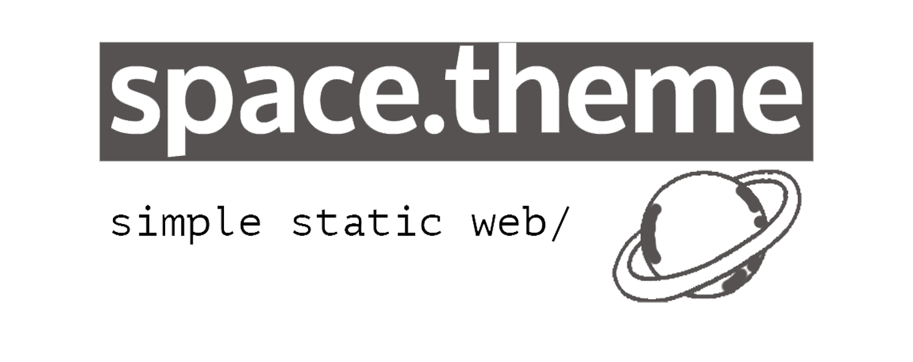
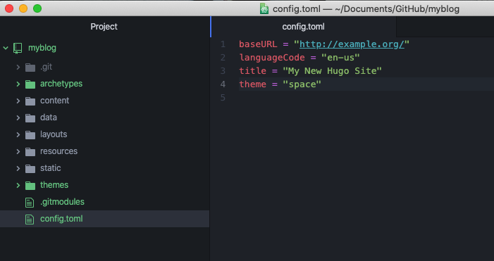
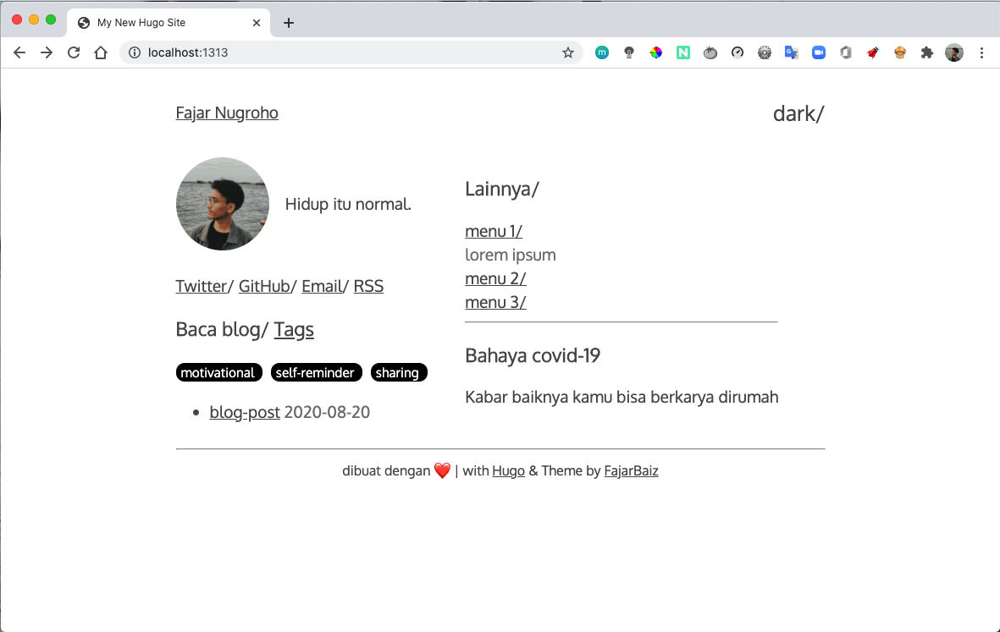
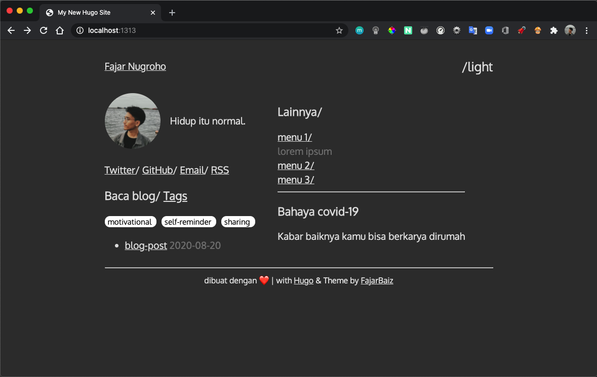
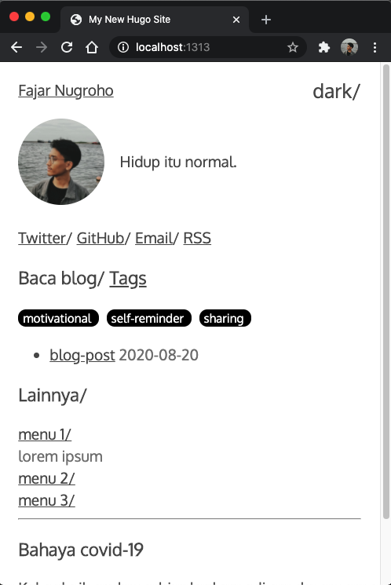

[](#contributors)
[](https://github.com/FajarBaiz/hugo-theme-space/releases)
[](https://github.com/FajarBaiz/hugo-theme-space/blob/master/LICENSE.md)
[](https://github.com/FajarBaiz/hugo-theme-space)

## Features
* Simple and easy to customize
* Dark mode

## Getting started
* If your website is using Git as version control, please do as follows:

1. Fetch the theme dir.

open your hugo website, then run the terminal:

```
git submodule add https://github.com/FajarBaiz/hugo-theme-space.git themes/space
```
2. then open config.toml in our hugo website dir, add the ``theme = "space"``



3. Finally, run:

```
hugo server -D
```
## Creating a blog post
```
hugo new posts/:blog-post.md
```

``blog-post.md`` is the name of the file of your new post.

will be saved in the ``content/posts/:blog-post.md``

## Configuring the Home Page
```
---
title: "blog-post"
date: 2020-08-20
Description: ""
tags:
- sharing
- motivational
- self-reminder
---

```
## Screenshot







# DEMO
[https://fajars.space](https://fajars.space)
